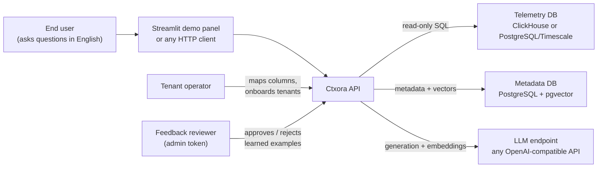
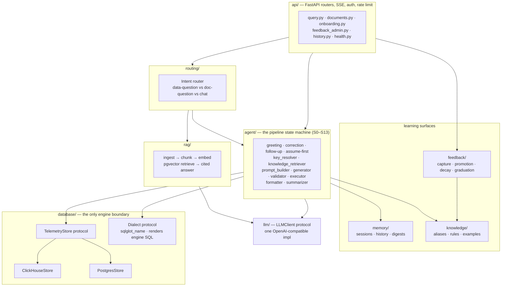
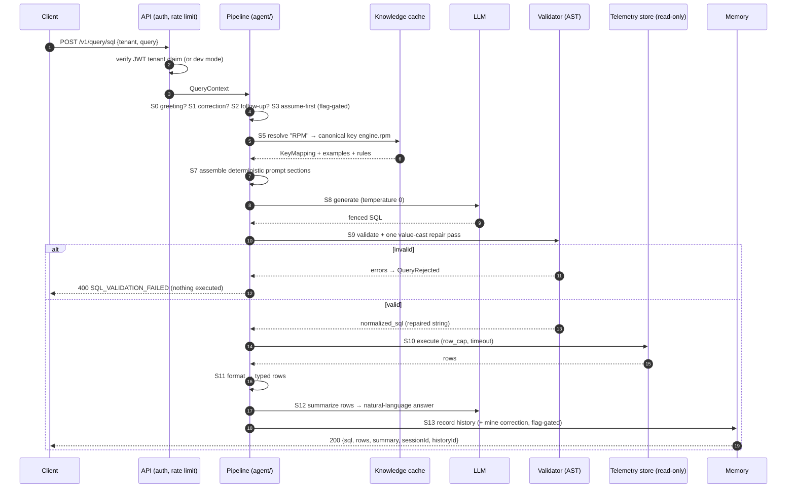
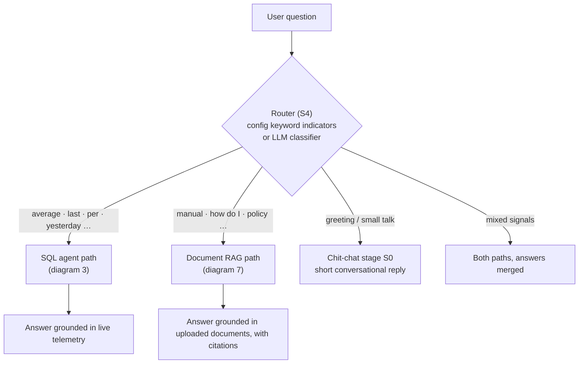
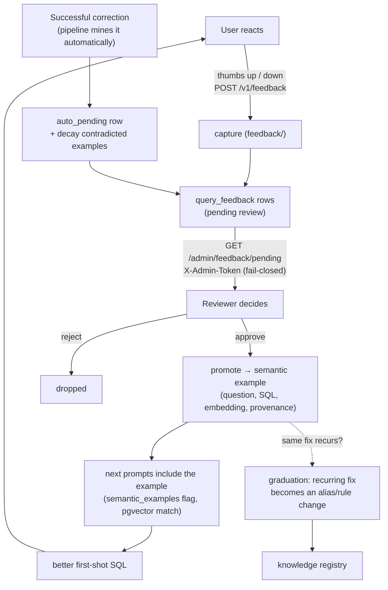
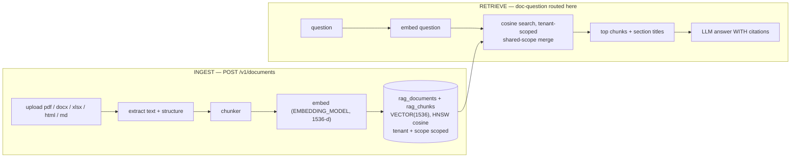
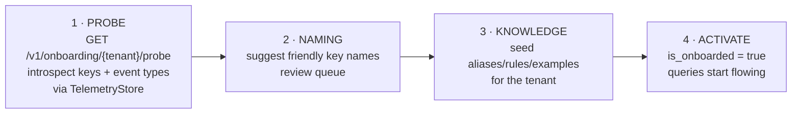
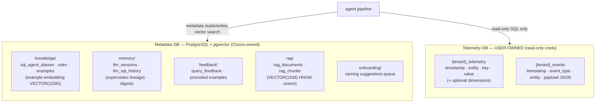
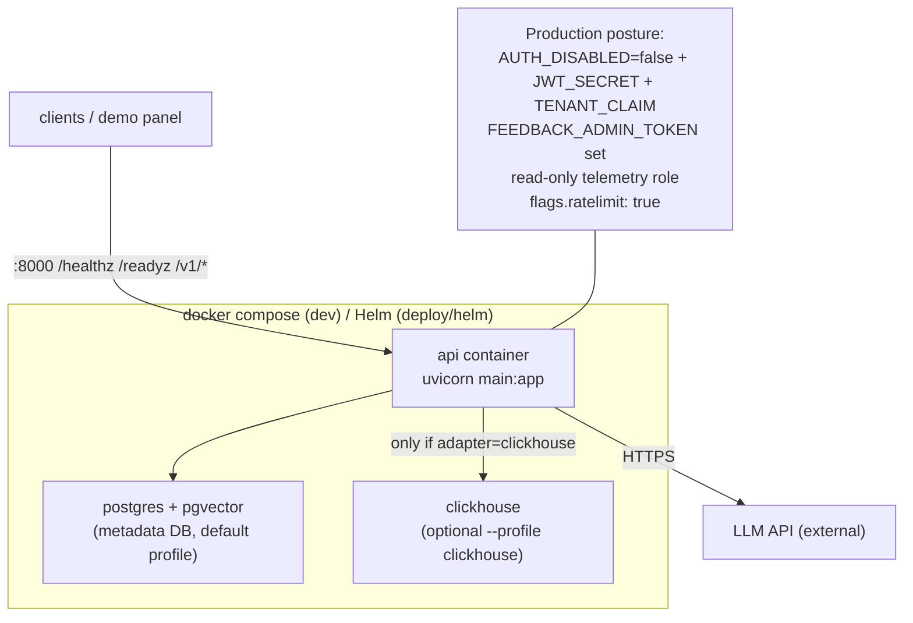

# Ctxora — Architecture Diagrams

> Visual companion to [`ARCHITECTURE.md`](ARCHITECTURE.md) (repo/module reference) and
> [`SYSTEM_DESIGN.md`](SYSTEM_DESIGN.md) (design rationale). All diagrams render on
> GitHub (Mermaid). Where a diagram and code disagree, the code wins — open a PR.

**Index**

1. [System context — who talks to Ctxora](#1-system-context)
2. [Component map — the running service](#2-component-map)
3. [The life of a query — NL→SQL pipeline](#3-the-life-of-a-query)
4. [Hybrid routing — SQL vs documents vs chat](#4-hybrid-routing)
5. [The SQL safety gauntlet — AST validation](#5-the-sql-safety-gauntlet)
6. [The feedback flywheel — how Ctxora learns](#6-the-feedback-flywheel)
7. [Document RAG — ingest and retrieve](#7-document-rag)
8. [Onboarding wizard — zero-code tenant bring-up](#8-onboarding-wizard)
9. [Data stores — what lives where](#9-data-stores)
10. [Deployment topology](#10-deployment-topology)

---

## 1. System context



Key idea: **the user's data never moves.** Ctxora points at an existing key-value
telemetry database and generates read-only SQL against it. The metadata DB and LLM
are Ctxora's own support infrastructure.

## 2. Component map

Arrows point down only (the dependency rule — `agent/` imports protocols, never engine clients):



## 3. The life of a query

Happy path for `"What was the average RPM of truck-102 yesterday?"` through
`POST /v1/query/sql` (SSE streaming variant streams S12):



The pipeline is the **only** state machine: every conversational behavior (correction
loop, follow-ups, assume-first) is a stage that either short-circuits or rewrites the
query, each behind a feature flag in `config/defaults.yaml`.

## 4. Hybrid routing



## 5. The SQL safety gauntlet

Every generated statement walks this gauntlet **before** execution — all checks
fail-closed, in this exact order (`agent/validator.py`). This replaced the old
regex blocklists in v1.0 (sqlglot AST — comments, smuggling tricks, and comma-joins
have no string surface to hide on):

```mermaid
flowchart TD
    s["generated SQL string"] --> p{"1 · Parse<br/>sqlglot, engine dialect<br/>ParseError + TokenError"}
    p -- "any parse/tokenize failure" --> rej1["REJECT: unparseable statement"]
    p -- "parsed" --> n{"2 · Single statement?"}
    n -- "no (stacked ; )" --> rej2["REJECT: multi-statement"]
    n -- "yes" --> root{"3 · Root allowlist<br/>SELECT / UNION / INTERSECT / EXCEPT<br/>(Subquery unwrapped)"}
    root -- "anything else incl. Command" --> rej3["REJECT: forbidden statement"]
    root -- "SELECT-shaped" --> mut{"4 · Mutation-node walk<br/>Insert Update Delete Drop Alter Create<br/>Into (SELECT…INTO) Lock (FOR UPDATE/SHARE)<br/>+ Grant Revoke Truncate Merge Copy"}
    mut -- "any mutation node" --> rej4["REJECT: forbidden statement"]
    mut -- "clean" --> fn{"5 · Dangerous functions<br/>read_csv · pg_read_file ·<br/>pg_read_binary_file · s3<br/>+ FROM/JOIN must be plain tables"}
    fn -- "named or table-function" --> rej5["REJECT: forbidden function"]
    fn -- "clean" --> tbl{"6 · Table allowlist<br/>CTE-aware, tenant tables only,<br/>qualified names NEVER allowed"}
    tbl -- "off-allowlist or schema-qualified" --> rej6["REJECT: table not allowed"}
    tbl -- "allowed" --> cte{"7 · CTE depth ≤ 5?"}
    cte -- "deeper" --> rej7["REJECT: CTE depth exceeds 5"]
    cte -- "ok" --> exec["EXECUTE via read-only store connection"]
```

Two invariants worth knowing:

- **One repair pass, max.** Bare aggregates get the dialect's null-safe cast wrapped
  once, then the gauntlet runs — no blind LLM retry loops.
- **The executed string is never re-emitted from the AST.** Parsing only gates; the
  SQL that runs is the (possibly repaired) original text, byte-identical.

Belt and suspenders: the validator assumes nothing about database privileges — deploy
with a read-only DB role anyway ([SECURITY.md](../../SECURITY.md)).

## 6. The feedback flywheel

Ctxora improves from usage without self-modifying prompts blindly — humans approve
what the system learns:



Decay uses canonical SQL comparison (`normalize_sql` — sqlglot canonical form), so the
same query written with different spacing/casing/comments is recognized as one.

## 7. Document RAG



## 8. Onboarding wizard

Zero-code tenant bring-up — the operator never edits Python:



## 9. Data stores



Column names in the telemetry store are whatever the user's schema has — they are
declared once in `config/defaults.yaml` (`stores.telemetry.mapping`).

## 10. Deployment topology



v1.0 is single-instance by design (in-memory rate limits, per-process knowledge
cache); see [SYSTEM_DESIGN.md § operational notes](SYSTEM_DESIGN.md#12-operational-notes)
for what changes at scale.
